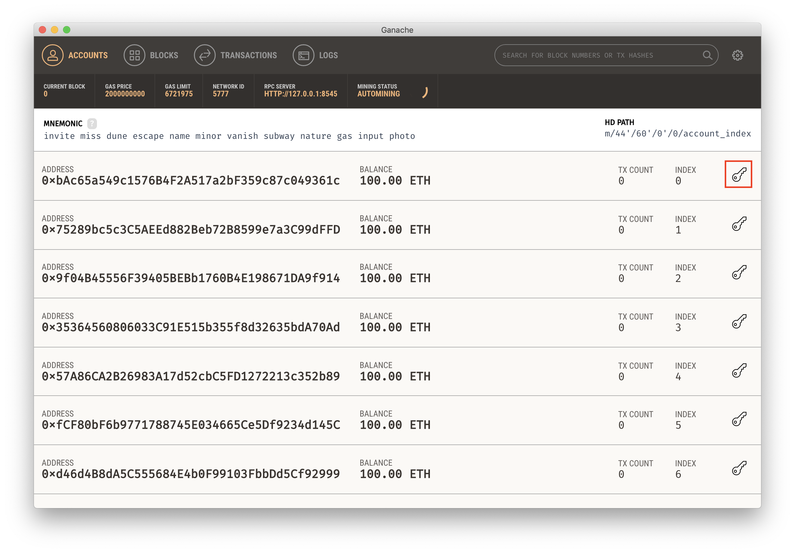
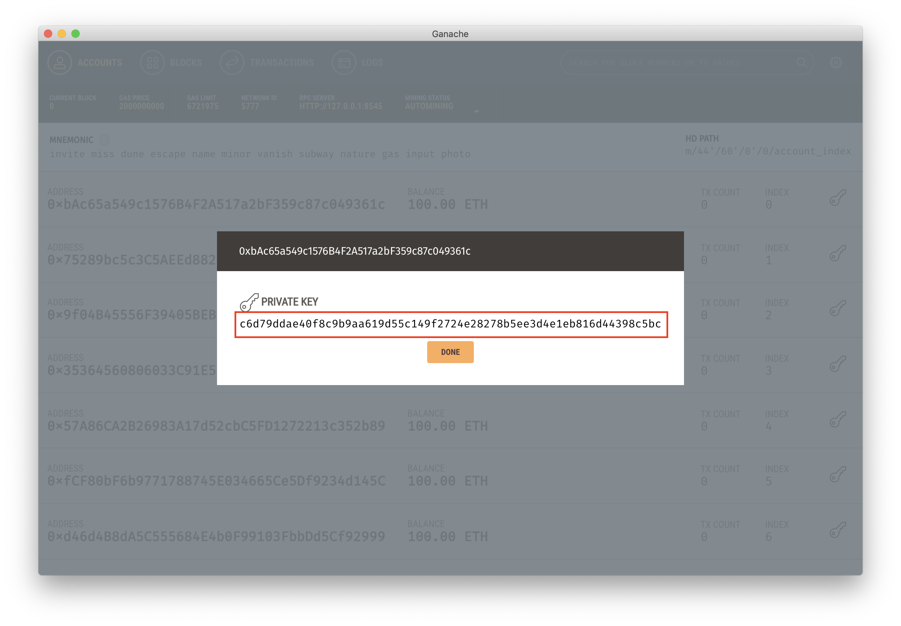
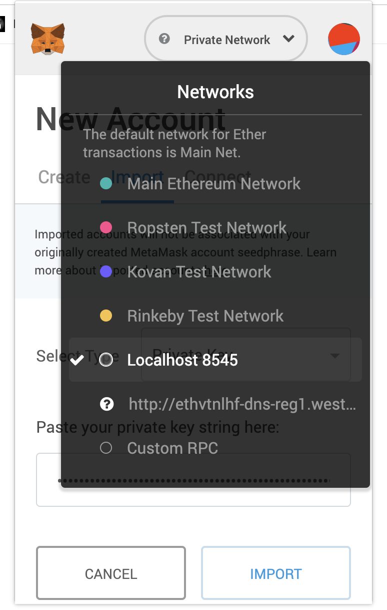
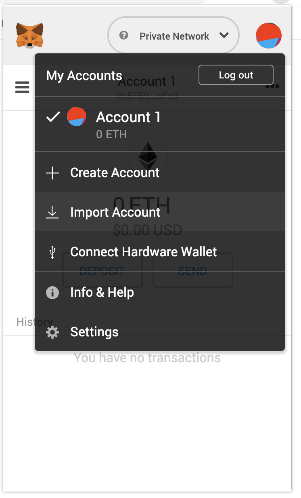
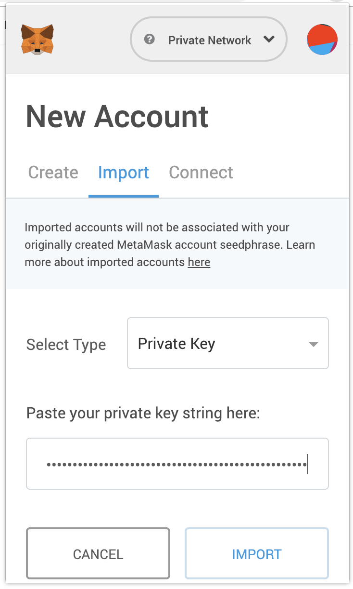

# ISKA Web3

This repository will contain all the code used in the demo. The Spring backend uses web3j to connect to the blockchain. The React frontend uses [drizzle](https://truffleframework.com/drizzle) to connect to the blockchain. It uses the [metamask](http://metamask.io) extension to get the current account.

## How to run

### Private blockchain

Run Ganache, this can be downloaded [here](https://www.truffleframework.com/ganache). This is the local blockchain that we will be using. The RPC endpoint will be available trought `localhost:8045`.

### Smart Contract

> Prerequirement: truffle (installed through `npm install truffle -g`)

run `truffle init` in the `iska-contract` folder. This will initialize truffle. Our smart contract will be placed under `/iska-contract/contracts/IskaContract.sol`.

Once the smart contract is filled in we will add the development network to the `truffle-config.js`. The network we will be using is listed here below.

```json
development: {
    host: "localhost", // Localhost (default: none)
    port: 8545, // Standard Ethereum port (default: none)
    network_id: "*", // Any network (default: none)
}
```

Once configured we can run the following commands

```bash
murf@Marvins-MacBook-Pro: [~/iska-contract] $ truffle compile
murf@Marvins-MacBook-Pro: [~/iska-contract] $ truffle migrate
```

There will be a `builds` folder which contains the `IskaContract.json`. This is used in the `iska-web`. You have to copy this to the `iska-web/src` folder.

Now you can start the web application by running the following commands. Note: the install needs to be only done once.

```bash
murf@Marvins-MacBook-Pro: [~~/iska-web] $ npm install
murf@Marvins-MacBook-Pro: [~~/iska-web] $ npm run
```

Now the web ui will be available on the browser at the following address: [http://localhost:3000](http://localhost:3000)

Make sure you open this in a chrome/firefox browser with a [MetaMask](https://metamask.io) extension installed. You can import an account by clicking on the _key_ icon in ganache and copying the private key.

Click the following icon


Copy the following value


Set metamask to use the `Localhost:8045` RPC.


Click the _Import Account_ button


Enter the value of the ganache private key and click _Import_


Now you're all set up, browse to [http://localhost:3000](http://localhost:3000) and see the application.
